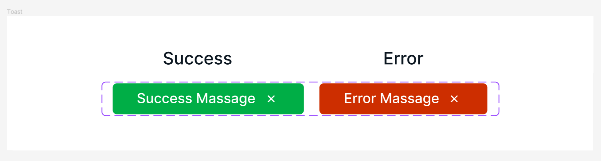

# Atomic Component 과제

[피그마 시안](https://www.figma.com/file/QBfNbiVVwFxPlyM2GF1lWY/ToastButton?type=design&node-id=0%3A1&mode=design&t=ei0UquBpBYA48NNE-1)



클릭하면 Success와 Error 버튼이 토글되는 Component를 구현했습니다.

### ToastButton.jsx

```js
import styles from "@/styles/ButtonStyle.module.css";
import close from "./../assets/close.svg";

const ToastButton = ({ state, isSuccess, handleChange }) => {
  console.log(isSuccess);
  let message = isSuccess ? state.success : state.error;
  let color = isSuccess ? styles.success : styles.error;

  return (
    <>
      <button type="button" className={color} onClick={handleChange}>
        {message}
        
      </button>
    </>
  );
};

export default ToastButton;
```

### App.jsx

```js
import ToastButton from "@/components/ToastButton";
import { useState } from "react";

function App() {
  let state = {
    success: "success message",
    error: "error message",
  };

  const [isSuccess, setIsSuccess] = useState(true);
  function handleChange() {
    setIsSuccess(!isSuccess);
  }
  return (
    <div className="App">
      <ToastButton
        state={state}
        isSuccess={isSuccess}
        handleChange={handleChange}
      />
    </div>
  );
}

export default App;
```
